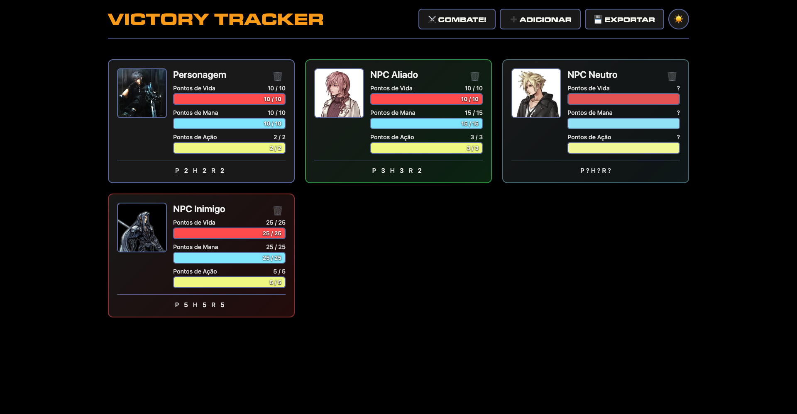
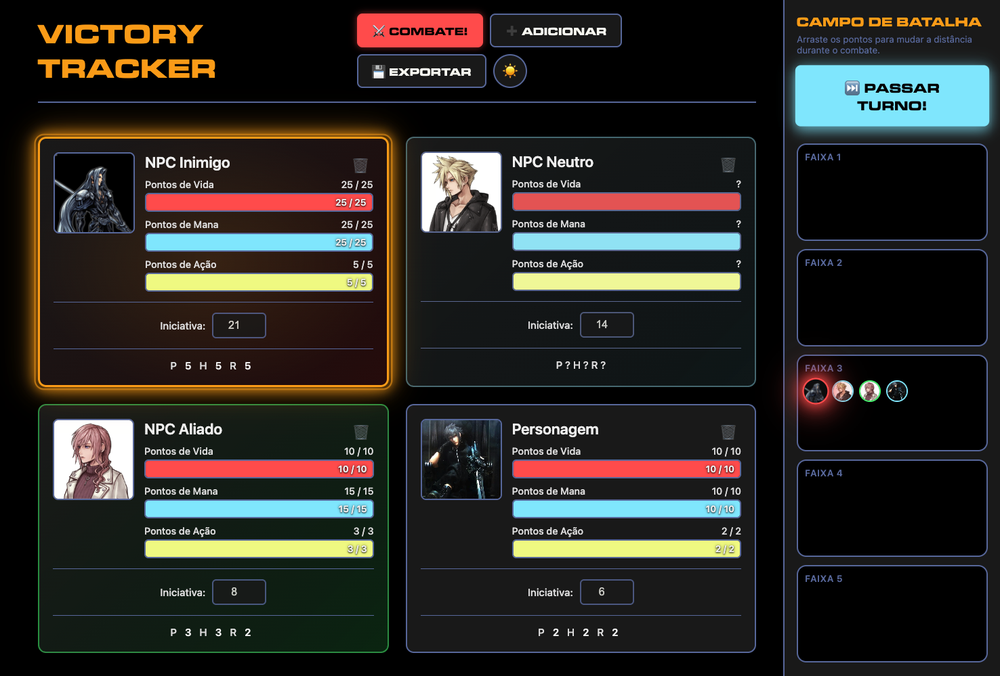

# 3DeT Victory Tracker

Uma ferramenta simples e prática para gerenciar personagens, combates e posicionamento no campo de batalha durante suas sessões de RPG de mesa do sistema 3DeT Victory.

---

## 📥 Como Baixar e Usar

### Passo 1: Baixar o Programa

1. No GitHub, clique no botão verde **"Code"** no topo da página
2. Clique em **"Download ZIP"**
3. Extraia o arquivo ZIP em uma pasta no seu computador
4. Abra a pasta extraída

### Passo 2: Abrir o Programa

1. Encontre o arquivo chamado **`index.html`**
2. Dê um duplo clique nele (ou clique com o botão direito e escolha "Abrir com" seu navegador)
3. O programa abrirá no seu navegador (Chrome, Firefox, Edge, etc.)

**Pronto!** Não precisa instalar nada, não precisa de internet depois de baixar. É só abrir e usar!

---

## 🎮 Como Usar

### Adicionar Personagens

1. Clique no botão **➕ Adicionar**
2. Preencha:
   - Nome do personagem
   - Foto (importe do computador, cole um link de imagem ou deixe em branco)
   - Tipo: Jogador, Inimigo, Aliado ou Neutro
   - Estatísticas: Poder, Habilidade e Resistência
3. Clique em **Adicionar**

### Alterar Vida, Mana ou Ação

1. **Dê dois cliques** na barra que você quer mudar (Vida, Mana ou Ação)
2. Digite: **`+10`** para aumentar ou **`-5`** para diminuir, ou apenas um número para definir o valor absoluto
3. Pressione Enter ou clique em **APLICAR**
4. Animações visuais indicam quando valores são modificados (cura, dano, gasto de mana/ação)

### Mudar Foto do Personagem

- **Dê dois cliques** na foto do personagem
- Cole um link de imagem ou faça upload de uma imagem
- Clique em **Aplicar**

### Modo Combate

1. Clique no botão **⚔️ COMBATE!** para ativar o modo de combate
2. Digite a **Iniciativa** de cada personagem (quanto maior, mais rápido age)
3. Os personagens aparecem ordenados por iniciativa (maior primeiro)
4. Clique em **⚔️ LUTAR!!** no painel do Campo de Batalha para iniciar o combate
5. Use **⏭️ PASSAR TURNO!** (no painel do Campo de Batalha) para avançar para o próximo personagem
6. O painel do **Campo de Batalha** aparece do lado direito durante o combate

### Campo de Batalha

- **Arraste** os pontos dos personagens entre as 5 faixas de distância
- Cada faixa representa uma distância diferente no combate
- Só é possível mover personagens **durante o turno deles**
- O personagem da vez fica **piscando** com um halo laranja brilhante
- O botão **⏭️ PASSAR TURNO!** aparece no topo do painel durante o combate ativo

### Salvar seus Dados

- Clique em **💾 Exportar** para baixar um arquivo com todos os seus personagens
- Guarde esse arquivo em segurança para não perder seus dados!

---

## Features

### Gerenciamento de Personagens
- Crie e organize todos os personagens da sua mesa
- Diferentes tipos: Jogadores (azul), Inimigos (vermelho), Aliados (verde)
- Acompanhe Vida, Mana e Pontos de Ação de cada um

### Sistema de Combate
- Organize os turnos por iniciativa
- Veja claramente quem é a vez de agir (halo laranja brilhante com animação pulsante)
- Animações suaves ao passar os turnos
- Botão "Passar Turno" destacado no painel do Campo de Batalha

### Campo de Batalha Visual
- 5 faixas de distância para organizar o combate
- Arraste personagens entre as faixas
- Veja a foto de cada personagem no campo de batalha
- O personagem da vez fica piscando para chamar atenção

### Barras de Status
- Barras coloridas mostram quanto cada personagem tem de Vida, Mana e Ação
- Animações visuais quando você cura, causa dano, gasta ou recupera mana/ação
- Cálculo automático dos valores máximos baseado nas estatísticas
- Aviso visual "Perto da Morte" quando a vida está igual ou abaixo da Resistência

## ⚠️ Importante

- Seus dados ficam salvos no navegador (não precisa de internet depois de baixar)
- Se limpar os dados do navegador, você pode perder seus personagens, por isso, **exporte regularmente** seus dados usando o botão Exportar
- Funciona melhor no computador.

## Contribuições
Contribuções são bem vindas. Abra um PR e solicite um review que assim que possível farei o merge. Para discussões, abra uma issue nesse projeto. 